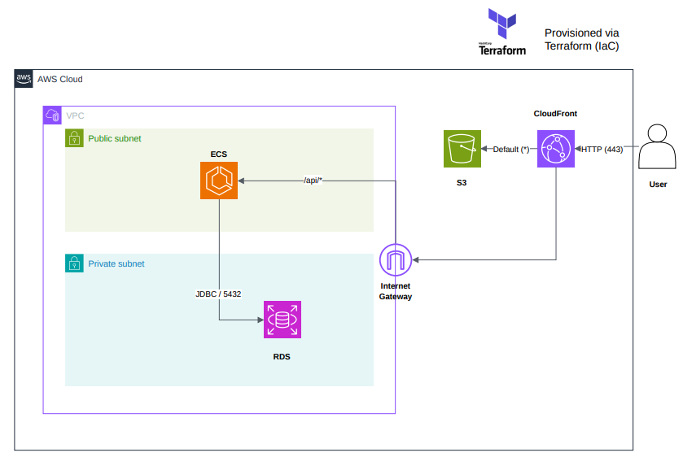

# Cosmetics E-Commerce | AWS Infrastructure as Code ☁️

This repository contains the Infrastructure as Code (IaC) required to provision and manage the cloud environment for a full-stack cosmetics e-commerce application. The architecture models a complete infrastructure on Amazon Web Services (AWS) using Terraform, transitioning from initial PaaS hosting (Heroku and Vercel) to a dedicated, secure, and production-ready cloud architecture.

**Status:** Completed / Staging on Demand 🚀

## 🎯 Architecture Overview

The infrastructure isolates the application layers within a custom Virtual Private Cloud (VPC), while serving the frontend globally and routing API traffic securely via a single CDN entrypoint:

* **Frontend:** Angular Single Page Application (SPA) stored in a private **Amazon S3** bucket using Origin Access Control (OAC), distributed globally via **Amazon CloudFront** with SSL/HTTPS.
* **Unified Routing (Reverse Proxy):** CloudFront handles incoming traffic, serving static assets from S3 (`/*`) and proxying dynamic requests (`/api/*`) directly to the backend through the Internet Gateway without CORS overhead.
* **Backend:** Java Spring Boot REST API running containerized on **Amazon ECS on EC2** within a public subnet.
* **Database:** Managed **Amazon RDS (PostgreSQL)** isolated in private subnets, accessible only by the ECS container via strict Security Group rules.

## 🛠️ Tech Stack & Services

| Category | Technology / AWS Service | Purpose |
| :--- | :--- | :--- |
| **IaC** | HashiCorp Terraform | Declarative infrastructure provisioning and state management |
| **Networking** | Amazon VPC, IGW, Subnets, Security Groups | Network isolation, CIDR blocks, and ingress/egress filtering |
| **Compute & Containers** | Amazon ECS (EC2 launch type), Docker | Containerized Spring Boot REST API orchestration |
| **Database** | Amazon RDS (PostgreSQL) | Managed relational database deployed in isolated private subnets |
| **Edge & Storage** | Amazon CloudFront, Amazon S3 (OAC) | Static asset hosting, CDN edge caching, and reverse proxy routing |

## 📂 Repository Structure

The infrastructure is organized modularly by cloud resource domain within the `terraform/` directory:

* `provider.tf` - AWS provider configuration, required versions, and backend definition.
* `vpc.tf` - Virtual Private Cloud, public and private subnets, Internet Gateway, and route tables.
* `security.tf` - Security Groups and network access control rules for ingress/egress filtering.
* `compute.tf` - ECS cluster orchestration, EC2 launch configurations, and container capacity.
* `ecs_app.tf` - ECS task definitions, service configurations, and application container definitions.
* `ecs_iam.tf` - IAM execution and task roles granting required AWS permissions.
* `ecs.tf` - Core ECS cluster settings and related integration resources.
* `rds.tf` - Amazon RDS PostgreSQL instance and database subnet groups.
* `frontend.tf` - S3 static website hosting, CloudFront CDN distribution, and Origin Access Control (OAC).
* `variables.tf` - Input variable declarations, data types, and default configurations.
* `outputs.tf` - Provisioned infrastructure outputs (e.g., CloudFront domain name, public endpoints).
* `docs/` - Project documentation and architecture diagrams.

## 🚀 How to Run

1. **Prerequisites:** Ensure you have the [Terraform CLI](https://developer.hashicorp.com/terraform/downloads) and [AWS CLI](https://aws.amazon.com/cli/) installed and configured with appropriate IAM credentials.
2. **Provision Infrastructure:**
   ```bash
   terraform init
   terraform plan
   terraform apply
 
 ## 📐 Architecture Diagram


